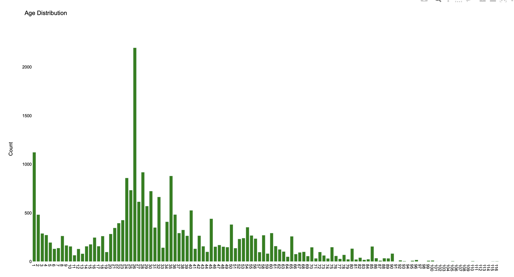
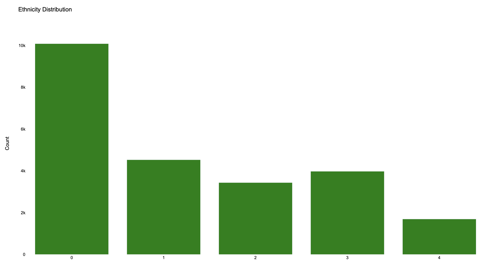
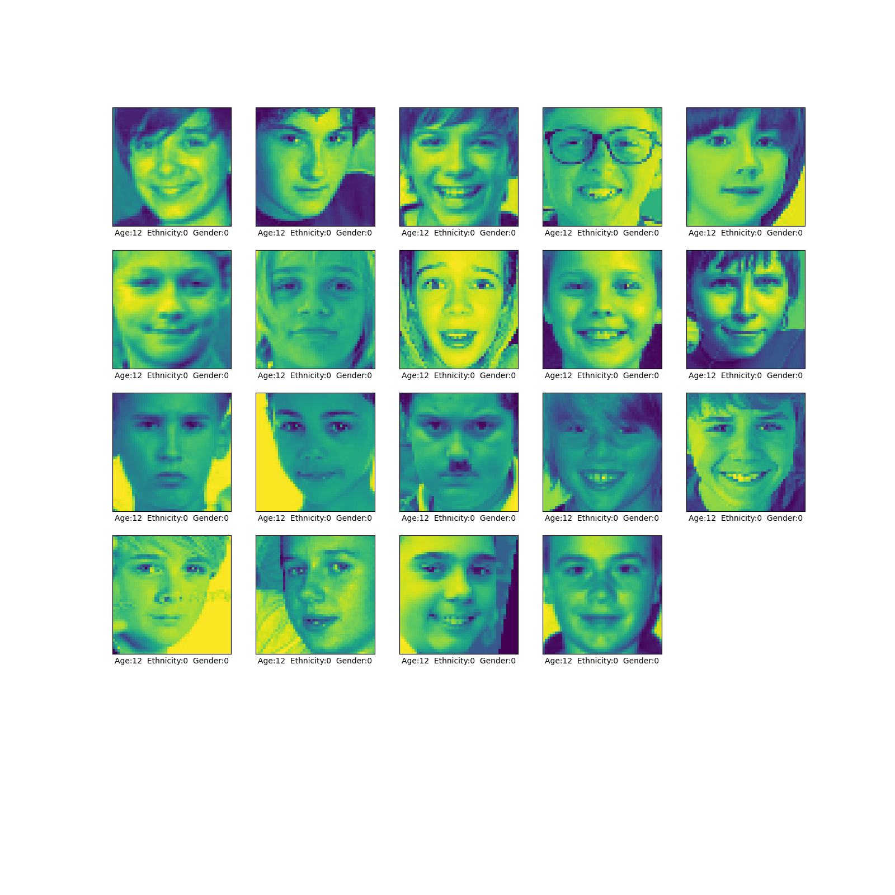
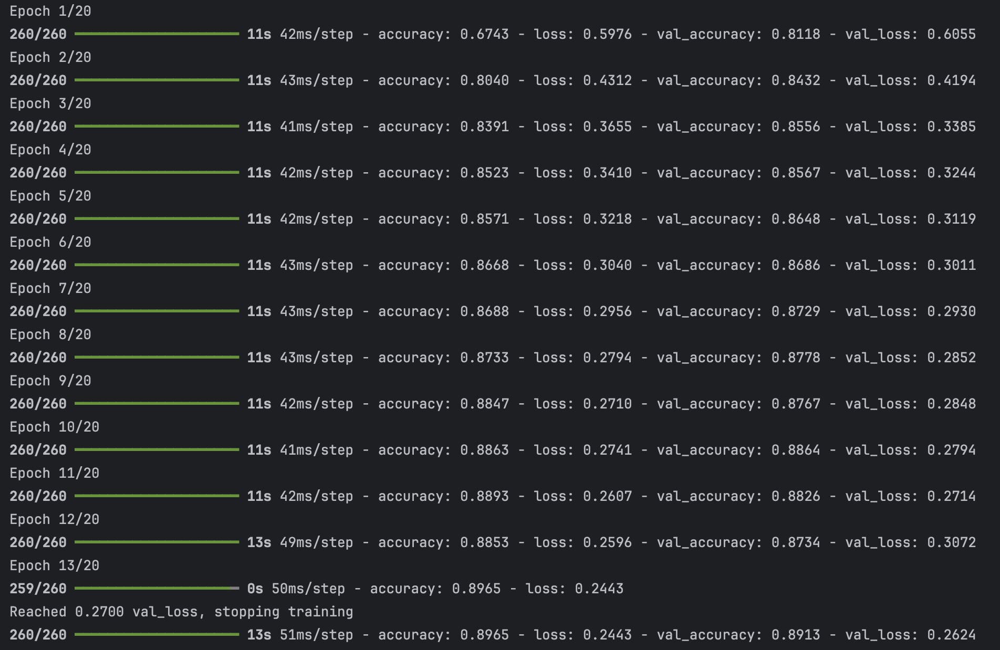
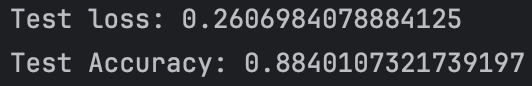
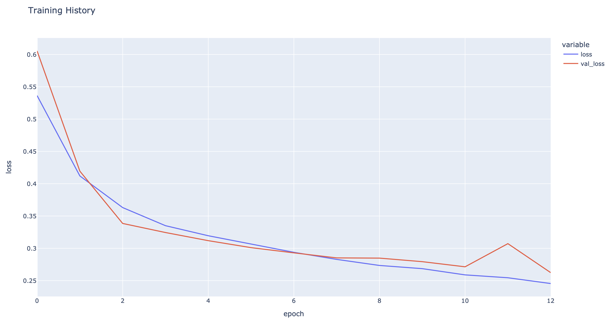
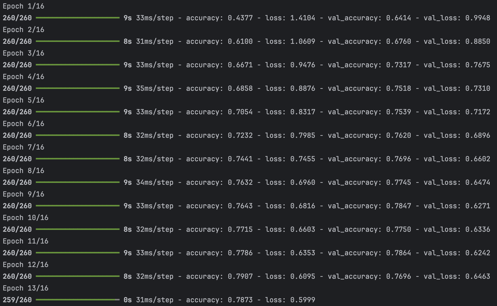
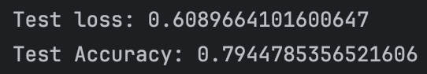
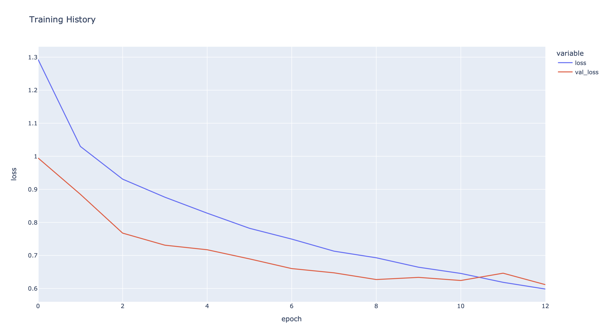

# gender-ethnicity-prediction-w-ML

This is my first project using tensorflow and sklearn libraries! 
I train a model: Convolutional Neural Network (CNN) and then visualize the results!

Kaggle Dataset: https://www.kaggle.com/code/shahraizanwar/age-gender-ethnicity-prediction/data

I WILL UPDATE THIS PROJECT AS I WORK ON IT

***

## IMPORTS
```ruby
import numpy as np
import pandas as pd
import tensorflow as tf
import tensorflow.keras.layers as L
import matplotlib.pyplot as plt
import plotly.graph_objects as go
import plotly.express as px
from sklearn.model_selection import train_test_split
```

## Loading the data and taking a look
```ruby
df = pd.read_csv("/Users/tanaymarathe/Downloads/age_gender.csv")

# Converting pixels into numpy array
df['pixels'] = df['pixels'].apply(lambda x: np.array(x.split(), dtype="float32"))

print(df.head())

   age  ...                                             pixels
0    1  ...  [129.0, 128.0, 128.0, 126.0, 127.0, 130.0, 133...
1    1  ...  [164.0, 74.0, 111.0, 168.0, 169.0, 171.0, 175....
2    1  ...  [67.0, 70.0, 71.0, 70.0, 69.0, 67.0, 70.0, 79....
3    1  ...  [193.0, 197.0, 198.0, 200.0, 199.0, 200.0, 202...
4    1  ...  [202.0, 205.0, 209.0, 210.0, 209.0, 209.0, 210...

[5 rows x 5 columns]
Total rows: 23705
```
Thats a lot of rows...


***

## Lets view the distribution of all the data in the file
```ruby
# normalizing pixels data
df['pixels'] = df['pixels'].apply(lambda x: x / 255)

# calculating distributions
age_dist = df['age'].value_counts()
ethnicity_dist = df['ethnicity'].value_counts()
gender_dist = df['gender'].value_counts().rename(index={0: 'Male', 1: 'Female'})


# function that creates plots from the desired variables
def distribution_plot(x, y, name):
    fig = go.Figure([
        go.Bar(x=x, y=y, marker_color='green')  # Change marker_color to set the color of the bars
    ])

    fig.update_layout(
        title_text=name,
        xaxis=dict(tickmode='linear'),  # Customize x-axis title and tick mode
        yaxis=dict(title='Count'),  # Customize y-axis title
        plot_bgcolor='rgba(0,0,0,0)',  # Set plot background color (rgba values: red, green, blue, alpha)
        font=dict(family='Arial', size=10, color='black'),  # Customize font style
    )

    fig.show()


# creates plots showing the occurrence of each variable in the data-set
distribution_plot(x=age_dist.index, y=age_dist.values, name='Age Distribution')
distribution_plot(ethnicity_dist.index, ethnicity_dist.values, 'Ethnicity Distribution')
distribution_plot(gender_dist.index, gender_dist.values, 'Gender Distribution')
```



###

## Lets look at a sample of the data, converting to pixels to images...
```ruby
# displays sample data from the dataset: range 1450-1469 (19 images)
plt.figure(figsize=(16, 16))
for i in range(1450, 1469):
    plt.subplot(5, 5, (i % 25) + 1)
    plt.xticks([])
    plt.yticks([])
    plt.grid(False)
    plt.imshow(df['pixels'].iloc[i].reshape(48, 48))
    plt.xlabel(
        "Age:" + str(df['age'].iloc[i]) +
        "  Ethnicity:" + str(df['ethnicity'].iloc[i]) +
        "  Gender:" + str(df['gender'].iloc[i])
    )
plt.show()
```


###

## Training model for gender prediction...
```ruby
X = np.array(df['pixels'].tolist())

# Converting pixels from 1D to 3D
X = X.reshape(X.shape[0], 48, 48, 1)

# building model for gender prediction...
y = df['gender']

X_train, X_test, y_train, y_test = train_test_split(X, y, test_size=0.22, random_state=37)

model = tf.keras.Sequential([
    L.InputLayer(input_shape=(48, 48, 1)),
    L.Conv2D(32, (3, 3), activation='relu', input_shape=(32, 32, 3)),
    L.BatchNormalization(),
    L.MaxPooling2D((2, 2)),
    L.Conv2D(64, (3, 3), activation='relu'),
    L.MaxPooling2D((2, 2)),
    L.Flatten(),
    L.Dense(64, activation='relu'),
    L.Dropout(rate=0.5),
    L.Dense(1, activation='sigmoid')
])

model.compile(optimizer='sgd',
              loss=tf.keras.losses.BinaryCrossentropy(),
              metrics=['accuracy'])


# Stop training when validation loss reach 0.2700
class myCallback(tf.keras.callbacks.Callback):
    def on_epoch_end(self, epoch, logs={}):
        if logs.get('val_loss') < 0.2700:
            print("\nReached 0.2700 val_loss, stopping training")
            self.model.stop_training = True


callback = myCallback()

model.summary()

history = model.fit(
    X_train, y_train, epochs=20, validation_split=0.1, batch_size=64, callbacks=[callback]
)

# graph for training/testing results (gender prediction)
fig = px.line(
    history.history, y=['loss', 'val_loss'],
    labels={'index': 'epoch', 'value': 'loss'},
    title='Training History')
fig.show()

# results for gender prediction :)
loss, acc = model.evaluate(X_test, y_test, verbose=0)
print('Test loss: {}'.format(loss))
print('Test Accuracy: {}'.format(acc))
```




pretty accurate :D

###

## Training model for ethnicity prediction...
```ruby
# time to train model for ethnicity prediction...
y = df['ethnicity']

X_train, X_test, y_train, y_test = train_test_split(
    X, y, test_size=0.22, random_state=37
)

model = tf.keras.Sequential([
    L.InputLayer(input_shape=(48, 48, 1)),
    L.Conv2D(32, (3, 3), activation='relu', input_shape=(32, 32, 3)),
    L.MaxPooling2D((2, 2)),
    L.Conv2D(64, (3, 3), activation='relu'),
    L.MaxPooling2D((2, 2)),
    L.Flatten(),
    L.Dense(64, activation='relu'),
    L.Dropout(rate=0.5),
    L.Dense(5)
])

model.compile(optimizer='rmsprop',
              loss=tf.keras.losses.SparseCategoricalCrossentropy(from_logits=True),
              metrics=['accuracy'])


# Stop training when validation accuracy reach 79%
class myCallback(tf.keras.callbacks.Callback):
    def on_epoch_end(self, epoch, logs={}):
        if logs.get('val_accuracy') > 0.790:
            print("\nReached 79% val_accuracy, stopping training")
            self.model.stop_training = True


callback = myCallback()

model.summary()

history = model.fit(
    X_train, y_train, epochs=16, validation_split=0.1, batch_size=64, callbacks=[callback]
)

# graph for ethnicity prediction
fig = px.line(
    history.history, y=['loss', 'val_loss'],
    labels={'index': 'epoch', 'value': 'loss'},
    title='Training History')
fig.show()

# summary for ethnicity prediction
loss, acc = model.evaluate(X_test, y_test, verbose=0)
print('Test loss: {}'.format(loss))
print('Test Accuracy: {}'.format(acc))
```



